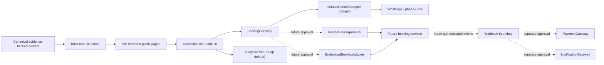

# Architecture

Status: APPROVED FOR PHASE-0 IMPLEMENTATION

## System shape

The site is a static-first Next.js App Router application using strict TypeScript. Public pages are pre-rendered from schema-validated repository content. Client JavaScript is limited to interactions such as the mobile menu and gallery filtering. There is no phase-0 database, first-party booking form, upload, payment or notification system.



Dashed paths are disabled until owner decisions, credentials, privacy/security review and explicit activation authority exist.

## Layers

1. **Evidence/content:** canonical business/location/contact/service-category records with evidence metadata.
2. **Domain:** booking intent, adapter contracts, analytics event schema and media publication gates.
3. **Application:** route composition and first-party state orchestration.
4. **UI:** semantic accessible components and consent-safe visual fallbacks.
5. **Infrastructure adapters:** phase-0 manual contact only; future providers remain isolated.

UI components never import provider SDKs, provider URLs or environment variables directly.

## Phase-0 invariants

- Booking mode defaults and fails closed to `manual-handoff`.
- The site collects no first-party booking PII.
- WhatsApp, phone and Visit links render as semantic HTML without JavaScript.
- Handoff success never means appointment confirmation.
- Invalid/untrusted query values do not control redirects, HTML, event names or booking status.
- Provider destinations are fixed or schema-validated against an origin allowlist.
- Analytics is no-op by default and cannot block navigation.
- Blocked content fails validation or is absent; it is not hidden only with CSS.
- No retained media publishes without rights, consent and derivative records.

## Content and evidence contract

Every factual or attributed entity includes:

```ts
type EvidenceClass =
  | "verified_fact"
  | "official_content_claim"
  | "customer_opinion"
  | "third_party_observation"
  | "analyst_inference"
  | "owner_confirmation";

type Publishability =
  | "publishable"
  | "attribution_required"
  | "time_sensitive"
  | "blocked";
```

Build validation checks source IDs, owner decisions, expiry and publishability. Canonical IDs remain framework- and provider-neutral.

## Deployment shape

Phase 0 requires only a managed Node-compatible runtime or a portable container/static-capable target supported by the selected Next.js output. The repository contains no production host selection, DNS mutation or credentials. Environment parsing permits only non-secret public configuration in the browser; future secrets remain server-only.

## Security boundaries

- Restrictive Content Security Policy with no provider script/frame in phase 0.
- Fixed outbound contact/directions destinations.
- No browser secrets or sensitive local storage.
- Security headers: HSTS in production, content-type protection, conservative referrer and permissions policies, and anti-framing unless a reviewed exception exists.
- Lockfile-based reproducible installs, dependency review and secret scanning.
- Structured coarse logs only; no contact details, free text, tokens, query strings or private image URLs.

## Failure and rollback

1. Provider/config failure returns manual contact paths on the same `/book` URL.
2. Media/content can be withdrawn by stable ID and replaced with the designed fallback.
3. Release rollback restores the last known-good immutable artifact, then smoke-tests Home, Services, Book, Visit and contact paths.
4. External booking/payment records are never deleted by a website rollback.
