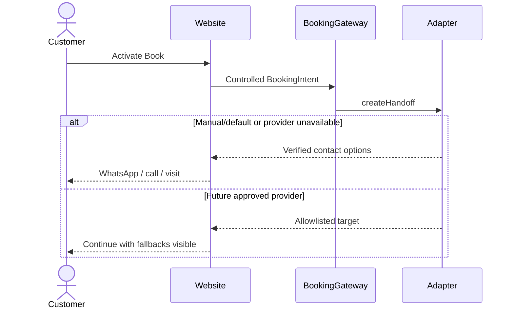

# Booking Architecture

Status: APPROVED FOR PHASE-0 MANUAL HANDOFF

## Current mode

`manual-handoff` is the default and only production-eligible mode with current owner information. The site may offer the verified WhatsApp/phone path and walk-in/Visit information. It may not expose live slots, prices, durations, staff selection, deposits, policies, uploads, confirmations or automated messages.

## Contract

```ts
type BookingMode =
  | "manual-handoff"
  | "hosted-redirect"
  | "embedded-widget"
  | "custom-scheduler";

type BookingIntent = Readonly<{
  entryPoint: string;
  serviceCategoryId?: string;
  galleryReferenceId?: string;
  campaign?: string;
}>;

type BookingCapability = Readonly<{
  liveAvailability: boolean;
  customerReschedule: boolean;
  customerCancel: boolean;
  inspirationUpload: boolean;
  paymentOrchestration: boolean;
}>;

type BookingHandoff =
  | Readonly<{ kind: "navigate"; channel: "whatsapp" | "phone" | "walk-in" | "hosted"; href: URL; external: boolean }>
  | Readonly<{ kind: "embed"; channel: "embedded"; integrationKey: string }>
  | Readonly<{ kind: "unavailable"; reason: "disabled" | "misconfigured" | "upstream-unavailable" }>;

interface BookingAdapter {
  readonly mode: BookingMode;
  capabilities(): BookingCapability;
  createHandoff(intent: BookingIntent): Promise<BookingHandoff>;
}
```

The implementation uses controlled enums/IDs rather than arbitrary query text. Provider mapping belongs to the adapter, not page components.

## Customer flow



## Canonical phase-0 copy

Heading: **Book or contact the studio**

Explanation: **Choose how you'd like to contact the studio. The website does not show live availability or confirm an appointment.**

Walk-ins are described only as accepted. Manual messages are requests, not confirmations.

## Future provider evaluation

A branded hosted specialist page is the preferred category for evaluation after the P0 owner packet is complete. It must pass mobile, accessibility, security/privacy, export, failure, lifecycle, data ownership and support tests. An embed is conditional because cross-origin accessibility, performance, CSP and failure recovery are harder to control. A custom scheduler is deferred.

## Capability gates

| Capability | Required gate |
| --- | --- |
| Provider sandbox | Complete P0 operations packet and synthetic-data evaluation |
| Live scheduling | Explicit activation, privacy/policies, operator training, rollback/export drill |
| Payment | Separate payment decision, credentials, sandbox, webhook and reconciliation tests |
| Notifications | Approved channels/templates/consent and failure escalation |
| Upload | Approved purpose, rights notice, private storage and retention/deletion |
| Custom scheduler | Measured provider gap, funded ownership, threat model and separate ADR |

## Security rules

- Default/failure mode is manual handoff.
- Allowlist outbound origins and reject unsafe schemes/open redirects.
- Treat provider return parameters as untrusted; show a neutral return state.
- Never put PII, free text or image URLs in analytics, logs or query strings.
- Payment and notification state remain independent of booking state.
- Future webhooks require signature/timestamp/replay verification, idempotency and explicit state transitions.

## Required tests

- canonical WhatsApp/tel URL generation;
- missing/invalid config safe default;
- unsafe URL and arbitrary intent rejection;
- manual/fake-hosted adapter conformance;
- provider timeout/malformed/blocked-script fallbacks;
- JavaScript-disabled contact path;
- false-success return query remains unconfirmed;
- keyboard, zoom, reduced-motion and screen-reader status behavior;
- analytics failure does not affect conversion.
