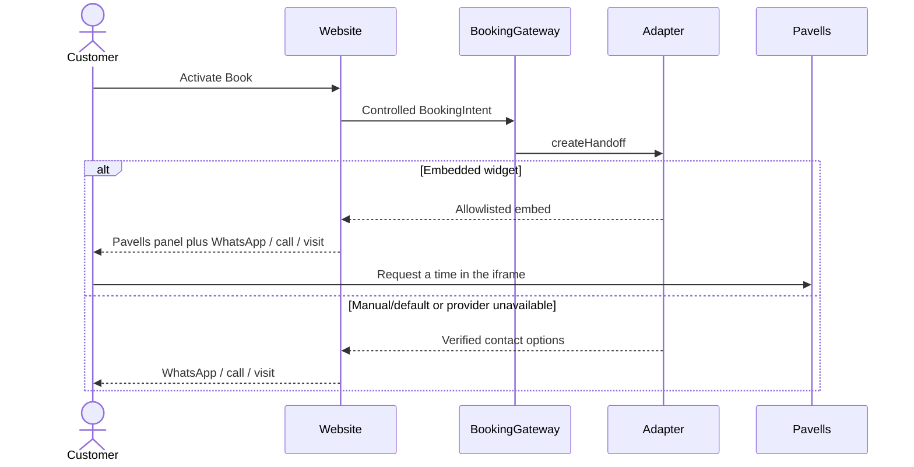

# Booking Architecture

Status: APPROVED FOR PAVELLS EMBED WITH MANUAL FALLBACK

## Current mode

`embedded-widget` is the default production mode after D-016. `/book` mounts the owner-supplied Pavells Booking panel (`beauty-nail-studio-by-cj2` on `booking.pavells.com`) and keeps WhatsApp, phone and walk-in visible. The provider slug is an account id, not a second public location.

`manual-handoff` remains the fail-closed and rollback mode (`BOOKING_MODE=manual-handoff`). Hosted-redirect and custom-scheduler stay unauthorized.

The site still must not invent prices, durations, staff, deposits, policies, first-party confirmations or automated messages.

## Contract

```ts
type BookingMode =
  | "manual-handoff"
  | "hosted-redirect"
  | "embedded-widget"
  | "custom-scheduler";

type BookingIntent = Readonly<{
  entryPoint: string;
  serviceCategoryId?: string;
  galleryReferenceId?: string;
  campaign?: string;
}>;

type BookingCapability = Readonly<{
  liveAvailability: boolean;
  customerReschedule: boolean;
  customerCancel: boolean;
  inspirationUpload: boolean;
  paymentOrchestration: boolean;
}>;

type BookingHandoff =
  | Readonly<{ kind: "navigate"; channel: "whatsapp" | "phone" | "walk-in" | "hosted"; href: URL; external: boolean }>
  | Readonly<{ kind: "embed"; channel: "embedded"; integrationKey: string }>
  | Readonly<{ kind: "unavailable"; reason: "disabled" | "misconfigured" | "upstream-unavailable" }>;

interface BookingAdapter {
  readonly mode: BookingMode;
  capabilities(): BookingCapability;
  createHandoff(intent: BookingIntent): Promise<BookingHandoff>;
}
```

The implementation uses controlled enums/IDs rather than arbitrary query text. Provider mapping belongs to the adapter, not page components. Category query values are not forwarded as Pavells `data-service` attributes.

## Customer flow



## Canonical copy

Heading: **Book or contact the studio**

Explanation: **Request a time in the booking panel, or contact the studio on WhatsApp, phone or as a walk-in. This website does not confirm an appointment by itself.**

Walk-ins are described only as accepted. Website query parameters still cannot confirm an appointment.

## Capability gates

| Capability | Required gate |
| --- | --- |
| Pavells embed | Owner-supplied public widget snippet (D-016); CSP `script-src`/`frame-src` allowlist; WhatsApp/phone/walk-in remain |
| Hosted redirect | Separate owner URL and origin allowlist |
| Payment | Separate payment decision, credentials, sandbox, webhook and reconciliation tests |
| Notifications | Approved channels/templates/consent and failure escalation |
| Upload | Approved purpose, rights notice, private storage and retention/deletion |
| Custom scheduler | Measured provider gap, funded ownership, threat model and separate ADR |

## Security rules

- Default production mode is the validated Pavells embed; failure and unauthorized modes are manual handoff.
- Allowlist outbound origins and reject unsafe schemes/open redirects.
- Treat provider return parameters as untrusted; show a neutral return state.
- Never put PII, free text or image URLs in analytics, logs or query strings.
- Payment and notification state remain independent of booking state.
- Future webhooks require signature/timestamp/replay verification, idempotency and explicit state transitions.

## Required tests

- canonical WhatsApp/tel URL generation;
- missing/invalid config safe default;
- unsafe URL and arbitrary intent rejection;
- Pavells embed mount plus manual fallback;
- fake-hosted adapter stays test-only;
- provider timeout/malformed/blocked-script fallbacks;
- JavaScript-disabled contact path;
- false-success return query remains unconfirmed;
- keyboard, zoom, reduced-motion and screen-reader status behavior;
- analytics failure does not affect conversion.
