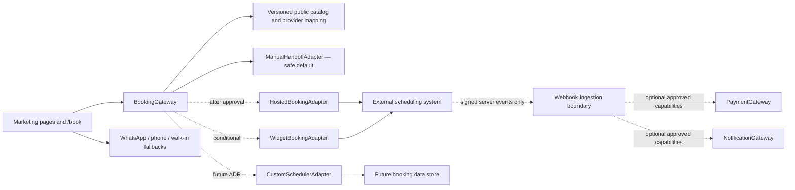

# Agent 3 report — booking operations and technical architecture

Status: **WORKING RECOMMENDATION — Agent 4 and owner approval required**
Prepared: 2026-08-17
Scope owner: Agent 3
Activation status: **No booking provider, payment service, notification service, analytics account, or deployment target selected or activated**

## 1. Executive recommendation

The website can launch a truthful, booking-first experience before automated scheduling is safe to implement. The launch path should be:

1. Build a branded `/book` page and persistent booking calls to action.
2. Route booking through a typed, replaceable `BookingAdapter` whose safe default is a manual handoff.
3. In the initial configuration, offer the verified WhatsApp/phone path plus visible walk-in information. Do not show slots, prices, durations, deposits, confirmations, or policy promises that the owner has not approved.
4. After every P0 operating decision is confirmed, evaluate real providers against a mandatory conformance checklist. A branded hosted specialist booking page is the preferred first automation path if it passes; an embedded widget is conditional; a custom scheduler is deferred.
5. Keep payment and notifications in separate server-side interfaces. Neither may be enabled merely because a future scheduling provider supports it.

This preserves the approved booking-first goal (`D-002`) and WhatsApp/walk-in fallbacks (`D-003`) without pretending that message handoff is a confirmed appointment. It also isolates the marketing site from one provider's data model.

The recommended application stack is a static-first Next.js App Router application with strict TypeScript, versioned structured content, CSS custom properties/modules, and provider-neutral server boundaries. It is a recommendation for Agent 4 to approve, not an approved cross-agent decision.

## 2. Authority, evidence, and non-decisions

### 2.1 Evidence used

| Evidence | Classification/status | What it supports |
|---|---|---|
| `docs/source/DECISION_LOG.md`, `D-002` | Approved owner decision | Booking is the primary conversion. |
| `docs/source/DECISION_LOG.md`, `D-003` | Approved owner decision | Keep WhatsApp and walk-in paths visible. |
| `facebook-profile` | Verified business source | WhatsApp/phone number, Facebook Message action, and daily public hours. |
| `instagram-profile` | Verified business source | Instagram Message invitations and walk-ins accepted. |
| Dataset `booking_signals.verified` | Mixed verified facts and one labeled analyst observation | Current handoff channels and the absence of a discovered first-party engine in the reviewed profiles. |
| Dataset `booking_signals.unresolved_requirements` and `information_gaps` | Research gaps | P0 operational requirements that block scheduling/payment design. |
| `MASTER_BRIEF.md` | Working baseline | Experience principles and P0 unknowns. |
| `BOOKING_REQUIREMENTS.md` | Owner input required | Replaceable adapter rule and prerequisite decisions. |
| `SECURITY_AND_PRIVACY.md` | Preliminary proposal | Minimum privacy and security direction. |

### 2.2 Evidence boundaries

- The Corner listing's cash/GCash/no-card statement is a low-confidence third-party claim (`source_id: corner-listing`). It is not a payment policy and must not appear in product behavior or public copy.
- The Reddit-reported BIAB price is a customer report (`source_id: reddit-june-2026`). It is not an official price and must not seed a booking catalog.
- Public hours are evidence for contact/location content, not proof that every service or staff member is bookable throughout that window.
- “No first-party booking engine was found” is an analyst observation tied to the reviewed public profiles, not proof that the business has no private scheduling process.
- `BOOKING_ARCHITECTURE.md`, `TECH_STACK_DECISION.md`, and `SECURITY_AND_PRIVACY.md` are templates/preliminary files, not approved decisions.

### 2.3 Decisions intentionally not made here

This report does not choose a booking, calendar, payment, messaging, storage, analytics, CMS, hosting, or deployment provider. It does not define service prices or durations, appointment capacity, deposits, refunds, cancellation terms, reminder timing, or data-retention periods. Those remain owner/Agent 4 decisions.

## 3. Booking-readiness requirements and P0 gaps

### 3.1 Readiness rule

An automated scheduler may be configured only when all P0 rows below have an owner-approved value, an accountable operator, and a testable representation. Partial answers must not be converted into implicit defaults.

“Manual handoff allowed” means the website may help the visitor contact the studio. It does **not** mean the website may claim a slot, quote an unverified amount, or display a success state reading “confirmed.”

### 3.2 Requirements matrix

| Area | Required owner-approved inputs | Current evidence/status | Blocked behavior | Manual-handoff launch |
|---|---|---|---|---|
| Service catalog | Canonical names, descriptions, categories, prices, durations, add-ons, removals, repairs, and complexity tiers | P0 unknown; only broad service categories are verified | Service-level slot search, price quote, duration calculation, automatic confirmation | Allowed with broad, verified interest categories only |
| Nail-art intake | How inspiration images, length/shape, complexity, charms, repairs, and removals change service choice/time/price | P0 unknown | Automatic recommendation or time/price adjustment | Ask the customer to discuss the look through the chosen channel; do not infer |
| Staff model | Roster, specialties, staff selection rules, schedules, leave, and substitutions | P0 unknown | Staff selection and staff-specific availability | No staff promises |
| Resources/capacity | Stations/resources, simultaneous capacity, service-to-resource mapping, group bookings, and double-booking rules | P0 unknown | Any live availability claim | No slot claims |
| Scheduling rules | Booking horizon, minimum lead time, buffers, cleanup time, timezone, operating exceptions, blocked time, and overbooking behavior | P0 unknown | Slot generation or reservation holds | Contact handoff only |
| Walk-ins | Capacity allocation, how operators block consumed capacity, and whether walk-ins share online inventory | Walk-ins are verified; allocation is unknown | Unified inventory and reliable online availability | Keep walk-in option visible without guaranteeing immediate service |
| Appointment lifecycle | Draft/hold/confirmed/completed/cancelled/no-show definitions and who may change each state | P0 unknown | Confirmation, self-service change, or status claims | Website records no appointment state |
| Policies | Rescheduling, cancellation, late arrival, no-show, service correction, and customer eligibility rules | P0 unknown | Policy enforcement and policy copy | No invented policy text |
| Payments | Accepted methods, deposit trigger/amount, taxes/fees, capture timing, receipts, refunds, disputes, and reconciliation owner | P0 unknown; third-party payment claim is not authoritative | Deposit, checkout, payment links, refund automation | No payment collection |
| Notifications | Required channels, transactional templates, consent/legal basis, reminder timing, escalation, opt-out handling, and sender ownership | P0 unknown | Automated confirmation/reminders | No automated messages from the site |
| Customer data | Required booking/contact fields, purpose, access roles, system of record, correction/deletion process, and retention schedule | Not approved | First-party booking/contact database | Prefer direct channel handoff; collect no booking PII on site |
| Inspiration uploads | Allowed formats/sizes, purpose, rights notice, access, moderation, retention/deletion, and failure path | P0 unknown | File upload | No upload in phase 1 |
| Administration | Named roles, least-privilege matrix, manual blocks/walk-ins, overrides, audit needs, support owner, and business-continuity process | P0 unknown | Custom admin, privileged provider configuration | Use existing studio-operated channels only |
| Data portability | Required exports, cadence, ownership, provider exit procedure, and retention after termination | Not approved | Provider commitment | Must be a procurement gate |
| Measurement | Definition of a qualified handoff, verified booking, source attribution, reporting owner, and privacy constraints | Analytics account and KPIs unresolved | Claiming completed-booking conversion | Anonymous/pseudonymous click events may be prepared but not activated |

### 3.3 P0 exit packet

Before provider evaluation becomes a selection, the owner should approve one version-controlled operations packet containing:

- service, add-on, and complexity catalog;
- staff/resource/capacity matrix;
- weekly schedule plus exception model;
- lead-time, buffer, hold, walk-in, and double-booking rules;
- appointment-state definitions and operator permissions;
- cancellation/rescheduling/late/no-show policy text;
- deposit, payment, refund, dispute, receipt, and reconciliation workflow;
- inspiration-image workflow and retention decision;
- transactional notification matrix and approved templates;
- minimum customer fields, retention/deletion rules, and privacy notice inputs;
- provider exit/export requirements and an outage runbook owner.

Agent 4 should record approvals in `DECISIONS.md`. Until then, the system must remain in `manual-handoff` mode.

## 4. Delivery phases and gates

| Phase | Customer capability | Data handled by first-party site | Entry gate | Exit evidence |
|---|---|---|---|---|
| 0 — truthful booking page | View verified contact/walk-in options; choose a broad verified area of interest; hand off | No booking PII; minimal consent-safe analytics only if later approved | Approved `D-002`/`D-003` and verified contact channels | CTA/fallback/accessibility/E2E tests pass |
| 1 — provider sandbox evaluation | Test hosted or embedded scheduling with synthetic records only | Non-production configuration and synthetic test data | Complete P0 packet and shortlist due diligence | Conformance, accessibility, failure, export, and security tests pass |
| 2 — scheduling pilot | Offer real availability and appointment management through approved provider | Minimum approved fields; provider is system of record | Explicit owner approval, privacy/policy publication, operator training, rollback drill | Reconciliation and support monitoring demonstrate stability |
| 3 — optional payment | Collect approved deposit/payment separately from scheduling | Payment references and minimum reconciliation data; never card details | Separate payment decision, credentials, policy, legal/security review, sandbox tests | Signed webhook, idempotency, refund, mismatch, and reconciliation tests pass |
| 4 — custom capability only if justified | Add requirements a specialist platform cannot meet | Depends on approved scope | Measured platform gaps, funded ownership, threat model, data model, and migration ADR | Full application security, operations, recovery, and support gates pass |

Production activation in phases 2–4 is outside this report's authority.

## 5. Widget vs hosted page vs custom application

### 5.1 Weighted launch-suitability comparison

Scores are provisional Agent 3 judgments from 1 (poor) to 5 (strong). They compare **categories**, not named vendors; a real provider may score differently after testing.

| Criterion | Weight | Embedded specialist widget | Branded hosted booking page | Custom scheduler |
|---|---:|---:|---:|---:|
| Speed/risk to a safe first automation | 20 | 4 | 5 | 1 |
| Ongoing maintenance and total-cost predictability | 15 | 4 | 5 | 1 |
| Fit for staff/resource/booking rules | 15 | 4 | 4 | 5 |
| Accessibility and performance control | 10 | 2 | 3 | 5 |
| Failure isolation and graceful fallback | 10 | 2 | 4 | 3 |
| Privacy/data minimization control | 10 | 2 | 3 | 4 |
| Branded mobile continuity | 10 | 4 | 3 | 5 |
| Portability and exit control | 5 | 2 | 2 | 5 |
| Verified analytics potential | 5 | 3 | 2 | 5 |
| **Weighted total / 100** | **100** | **65** | **77** | **66** |

### 5.2 Category assessment

#### Branded hosted specialist page — preferred first automation, conditional

Why it leads: the third-party application is failure-isolated from the marketing page, adds little first-party JavaScript, and can be replaced behind a normal link/redirect. The provider owns more of the scheduler UI and operational application surface.

Conditions: it must pass the requirements/conformance checklist, mobile and accessibility review, data-processing/security review, export test, webhook/API needs, domain/return-flow requirements, and a full synthetic booking lifecycle. The website must always explain that the customer is continuing to the booking service and retain the verified fallbacks.

#### Embedded specialist widget — not the default

Potential benefit: more branded continuity and fewer visible navigation steps.

Primary risks: cross-origin accessibility cannot be repaired by the website team; third-party script failure can block the flow; widget JavaScript and layout can degrade mobile performance; Content Security Policy expands; browser privacy features may interfere; and error/analytics visibility may be incomplete. Consider only if a provider's hosted flow is materially worse and the widget independently passes keyboard, screen-reader, small-screen, slow-network, blocked-script, and failure-fallback tests.

#### Custom scheduler — rejected for the current phase, not permanently

Potential benefit: maximum control over unusual complexity/resource/image rules, experience, portability, and verified event semantics.

Reason for deferral: the business rules, admin workflow, policies, payment workflow, privacy model, and operational support capacity are unresolved. Custom code would convert unknowns into risky product behavior and make this project responsible for concurrency, slot locking, identities, authorization, auditing, notification delivery, payment reconciliation, backup/recovery, and support.

Revisit only when measured requirements cannot be met by validated specialist platforms and the owner approves the continuing engineering/operations cost.

### 5.3 Provider conformance gate (no vendor chosen)

A candidate fails selection if it cannot demonstrate all mandatory items relevant to the approved operations packet:

- canonical service IDs, durations, add-ons, removals, complexity, and optional staff selection;
- correct staff/resource capacity, buffers, exceptions, manual blocks, walk-ins, and atomic double-booking prevention;
- explicit timezone handling and clear customer/operator timestamps;
- complete booking, reschedule, cancel, late/no-show, and admin-override workflows;
- safe inspiration-image support or a clean way to defer the image to a separate approved channel;
- Philippines-relevant currency/payment support **only if** payments are later approved;
- transactional channels, consent controls, templates, delivery status, and duplicate suppression required by the approved notification matrix;
- responsive, keyboard-usable, screen-reader-reviewed customer flow with meaningful errors;
- API/webhook or return mechanism sufficient to distinguish handoff from verified confirmation;
- signed/replay-resistant webhook support if server events are used;
- data export that is tested, usable, documented, and contractually owned by the studio;
- deletion/correction support, subprocessor/transfers disclosure, security documentation, incident path, and account/role controls;
- sandbox/test mode, audit history, availability/status communication, support escalation, and rollback/export procedure;
- transparent cost model under the approved operating volume.

## 6. Replaceable booking architecture

### 6.1 Design rules

1. The website owns canonical public IDs and copy; a provider mapping layer owns provider IDs.
2. Marketing components depend on a `BookingGateway`, never on provider SDKs, URLs, schemas, or global objects.
3. `manual-handoff` is the safe default when configuration is absent, invalid, disabled, or unhealthy.
4. The first-party `/book` page always remains available and always renders fallbacks without third-party JavaScript.
5. Provider URLs are constructed from approved configuration or returned by a server adapter and checked against an origin allowlist. Never redirect to a user-supplied URL.
6. Starting a handoff is not a booking confirmation. Only an authenticated provider event or approved system-of-record query may produce `confirmed`.
7. Payment and notification state are orthogonal to scheduling state.
8. Analytics failure never blocks conversion; provider failure never removes the manual fallbacks.
9. No customer PII or free text is placed in analytics, query strings, or logs.

### 6.2 Component boundary



Dashed paths are inactive until separately approved.

### 6.3 Suggested TypeScript contracts

The exact file layout belongs to implementation planning, but the public contract should be equivalent to:

```ts
type BookingMode =
  | "manual-handoff"
  | "hosted-redirect"
  | "embedded-widget"
  | "custom-scheduler";

type BookingChannel =
  | "whatsapp"
  | "phone"
  | "walk-in"
  | "hosted"
  | "embedded"
  | "custom";

type BookingIntent = Readonly<{
  entryPoint: string; // controlled internal enum in implementation
  serviceCategoryId?: string; // canonical, verified public category only
  galleryReferenceId?: string; // internal public media/content reference only
  campaign?: string; // sanitized allowlisted attribution value
}>;

type BookingCapability = Readonly<{
  liveAvailability: boolean;
  customerReschedule: boolean;
  customerCancel: boolean;
  inspirationUpload: boolean;
  paymentOrchestration: boolean; // false until a separate payment decision
}>;

type BookingHandoff =
  | Readonly<{
      kind: "navigate";
      channel: Exclude<BookingChannel, "embedded" | "custom">;
      href: URL;
      external: boolean;
    }>
  | Readonly<{
      kind: "embed";
      channel: "embedded";
      integrationKey: string; // non-secret registry key, not executable markup
    }>
  | Readonly<{
      kind: "unavailable";
      reason: "disabled" | "misconfigured" | "upstream-unavailable";
    }>;

interface BookingAdapter {
  readonly mode: BookingMode;
  capabilities(): BookingCapability;
  createHandoff(intent: BookingIntent): Promise<BookingHandoff>;
}
```

Implementation constraints:

- Parse configuration and content with runtime schemas at build/startup; fail closed to `manual-handoff`.
- Keep `serviceCategoryId` and `galleryReferenceId` from controlled content. Do not accept arbitrary query text and forward it to a provider.
- Keep provider mapping in one adapter-owned module/data file with mapping version and validation that every active public service maps exactly once.
- Render phone and WhatsApp as normal semantic links so they work without JavaScript. The verified number is `+63 961 740 0664` (`source_id: facebook-profile`); normalized link forms should be tested rather than hand-entered in components.
- A manual WhatsApp prefill may contain a generic greeting and controlled service category, but must not contain sensitive details, customer identity, appointment claims, or a private image URL.
- If a hosted provider supports a return URL, treat its query string as untrusted. Display a neutral “return from booking service” state unless the server verifies the status.
- If a widget is added, load it only on `/book`, reserve layout space, provide a skip/fallback path before it, and time out to the fallback state.

### 6.4 Safe configuration and rollback

Use an explicit mode such as `BOOKING_MODE=manual-handoff`; the default for missing/invalid configuration is manual handoff. Provider credentials and webhook secrets are server-only environment secrets. Public provider origins and non-secret integration IDs still require schema validation and an allowlist.

Rollback from any future provider must require only:

1. switch the mode to `manual-handoff`;
2. redeploy/reload validated configuration;
3. verify `/book`, WhatsApp, phone, and walk-in paths;
4. preserve provider records for operator reconciliation/export;
5. stop accepting provider callbacks without deleting the audit trail.

No marketing-page rewrite should be necessary.

### 6.5 Booking sequence with failure fallback

```mermaid
sequenceDiagram
  actor C as Customer
  participant S as Website
  participant G as BookingGateway
  participant P as Future provider
  participant A as Analytics boundary
  C->>S: Activate Book CTA
  S->>A: booking_cta_clicked (no PII)
  S->>G: createHandoff(controlled intent)
  alt manual-handoff or invalid provider config
    G-->>S: verified manual channel
    S-->>C: WhatsApp / phone / walk-in options
  else approved provider available
    G->>P: create/resolve handoff without browser secret
    alt provider responds
      P-->>G: allowlisted handoff target
      G-->>S: navigate or embed descriptor
      S->>A: booking_handoff_started
      S-->>C: Continue to provider; fallbacks remain visible
    else timeout or invalid response
      G-->>S: unavailable
      S->>A: booking_handoff_failed
      S-->>C: Clear error plus WhatsApp / phone / walk-in options
    end
  end
```

## 7. State ownership and integration boundaries

### 7.1 Scheduling state

In phase 0, the website has no appointment record; the studio's existing off-site process remains the operational system of record. After a specialist provider is explicitly approved and activated, that provider should be the sole online scheduling inventory unless a later approved decision says otherwise. The marketing site should store no shadow booking merely to support UI.

Suggested normalized state vocabulary for integration/reporting:

- `handoff_started` — first-party site successfully transferred control; not an appointment;
- `pending` — provider has an incomplete/held record, only if its authenticated API defines this state;
- `confirmed` — authenticated provider event/query confirms the appointment;
- `changed` — confirmed appointment was rescheduled/modified;
- `cancelled`, `completed`, `no_show` — only from the approved system of record/operator process;
- `unknown` — status cannot be verified; must never be presented as confirmed.

Events must be monotonic according to an explicit transition table. Duplicate/out-of-order events must not regress a terminal or newer state.

### 7.2 Calendar boundary

Do not make a general calendar both a writable availability source and a second appointment system without an approved conflict model. Prefer one authoritative scheduling inventory, then expose calendar synchronization as a derived convenience. Provider evaluation must test manual blocks, walk-ins, sync delay/failure, recurring availability, exceptions, and concurrent updates.

### 7.3 Payment boundary (inactive)

`PaymentGateway` must be a separate server-side interface activated only after payment operations are approved. A booking adapter may declare that it can coordinate a deposit, but marketing/UI code must not call provider payment APIs directly.

Required invariants:

- use approved currency and integer minor units; never calculate money from display strings;
- never collect or store card credentials on the website;
- create payment operations server-side with idempotency keys;
- verify signatures and replay windows on raw webhook payloads;
- record provider event IDs and process duplicates safely;
- distinguish `pending`, `authorized`, `captured`, `failed`, `refunded`, and `disputed` from booking status;
- do not label an appointment confirmed solely because money moved;
- reconcile payment, booking, receipt, refund, and operator records on an approved cadence;
- route “payment succeeded, appointment failed” and inverse mismatches to a visible operator queue/runbook;
- redact customer/payment data from logs and analytics;
- test sandbox success, decline, abandon, duplicate, timeout, delayed webhook, refund, and mismatch paths before activation.

Deposit amount/type, capture timing, refunds, and reconciliation ownership are P0 owner decisions, not adapter defaults.

### 7.4 Notification boundary (inactive)

`NotificationGateway` must accept normalized transactional events rather than be called from page components or payment code. It should own channel routing, approved templates, deduplication, provider message IDs, delivery status, retry policy, and operator escalation.

Before activation, approve:

- which events require a notice and which channel(s) may be used;
- exact templates, locale, timezone display, sender identity, quiet-time behavior, and support contact;
- the minimum message content and whether sensitive appointment details are permitted;
- legal basis/consent and opt-out handling for each channel;
- separate marketing consent and suppression controls; transactional contact must not silently enroll marketing;
- delivery-failure fallback and retry limits.

Notification failure must not silently cancel or create an appointment. A provider “sent” result is not proof of customer delivery.

### 7.5 Inspiration-image boundary (inactive)

Do not add a first-party upload in phase 0. If approved later:

- accept only necessary image formats and a documented maximum size/count;
- verify extension, declared MIME type, and detected content; reject mismatches;
- use random object keys and private storage; never expose a permanent public URL;
- upload through a short-lived, least-privilege mechanism and scan/process away from the public request path;
- remove unnecessary metadata where compatible with the approved use;
- present purpose, staff access, rights/consent notice, and deletion timing before upload;
- use expiring access links and audited staff authorization;
- keep object URLs and image contents out of logs, analytics, support screenshots, and query strings;
- delete rejected, abandoned, expired, and fulfilled images according to the approved retention schedule;
- provide an error path that does not falsely reserve or confirm an appointment.

## 8. Privacy and security requirements

These are engineering requirements, not legal advice. The owner must obtain appropriate legal review for public privacy, booking, payment, and communications policies before production data collection.

### 8.1 Data-minimization baseline

Phase 0 should collect no first-party booking form data. The site may record a minimal event that a channel was selected only after an analytics decision; it cannot see or store the subsequent WhatsApp/phone conversation.

Before automated booking, maintain a data inventory containing field, purpose, system of record, source, access roles, processors/subprocessors, retention/deletion rule, export/correction path, and whether it may appear in logs/analytics. Free-form notes and inspiration images require heightened review because they may contain unexpected personal content.

### 8.2 Required controls

| Surface | Minimum control |
|---|---|
| Browser | No secrets; semantic controls; output encoding; restrictive Content Security Policy; `frame-src` expanded only for an approved widget; safe external-link behavior; no PII in URLs/storage |
| Forms/API | Server-side schema validation, request/body limits, rate limiting, accessible spam control, CSRF protection where browser credentials are used, generic public errors |
| Redirects | Fixed/allowlisted destinations; no open redirect; controlled attribution values only |
| Secrets | Environment/secret store only; least privilege; separate environments; rotation/revocation runbook; never in repository, client bundle, logs, or screenshots |
| Webhooks | HTTPS; signature verification on raw body; timestamp/replay validation; idempotent event ID; explicit transition validation; async retry/dead-letter/manual recovery; secret rotation |
| Admin | Named accounts, least privilege, strong authentication/MFA where supported, no shared credentials, audit log, session expiry, prompt deprovisioning |
| Uploads | Private storage, content validation, size/count limits, scanning, random keys, expiring access, retention/deletion, authorization audit |
| Logs | Structured operational metadata only; redact identifiers, contact details, free text, image URLs/content, tokens, payment data, and query strings |
| Dependencies | Lockfile, reproducible build, automated vulnerability/license review, prompt security updates, minimal third-party scripts |
| Transport/headers | HTTPS; HSTS in production; `X-Content-Type-Options`; suitable `Referrer-Policy`; `Permissions-Policy`; anti-framing policy except explicitly reviewed cases |
| Resilience | Timeouts, bounded retries with jitter, circuit/fallback behavior, backups/exports where data exists, restoration and provider-exit tests |

Use the current stable OWASP ASVS as the security verification framework, with requirements selected proportionally for the eventual application surface. A static marketing/handoff site and a custom scheduler do not have the same risk profile.

### 8.3 Threat/failure assumptions

| Threat | Design response |
|---|---|
| Attacker changes outbound booking destination | Destinations come from validated deployment config and an origin allowlist; no user-controlled redirect |
| Bot/spam traffic | Phase 0 has no form; future forms use server validation, rate limits, and accessible abuse controls |
| Forged or replayed provider event | Verify signature/timestamp, persist unique event ID, enforce state transition, reject unverifiable events |
| Client claims success through return URL | Return query is untrusted; verify server-side or show neutral status |
| Third-party script compromise/failure | Prefer hosted redirect; isolate optional widget; restrictive CSP; fallbacks rendered first |
| Sensitive data leakage in analytics/logs | Fixed event schema, key allowlist, redaction tests, no free text/PII/URLs |
| Unauthorized inspiration-image access | Private object access, short-lived links, staff authorization, retention deletion, audit |
| Privileged account takeover | MFA where supported, individual least-privilege accounts, audit, revocation runbook |
| Provider lock-in/loss | Canonical internal IDs, adapter mapping, tested export, contract/exit review, manual-mode rollback |

## 9. Failure modes and required behavior

| Failure mode | Customer behavior | Operator/technical behavior | Required test |
|---|---|---|---|
| Booking configuration missing/invalid | `/book` renders verified manual options; no blank state | Structured non-sensitive error; deployment check fails or warns; safe default remains | Unit + production-config smoke test |
| Hosted provider unavailable/timeout | Clear temporary message and immediate WhatsApp/phone/walk-in choices | Timeout/circuit signal; no infinite retry; alert threshold later approved | Integration + E2E fault injection |
| Widget script blocked or slow | First-party content and fallbacks remain usable; reserved widget area does not trap focus | Record non-PII load failure if analytics available; offer hosted/manual route | Blocked-request/slow-network E2E |
| JavaScript disabled | Semantic booking and phone links remain usable | No dependency on hydration for core handoff | Browser E2E/manual check |
| Popup blocked | Use a normal same-tab/new-tab link with visible destination semantics | Do not rely on `window.open` success | Browser E2E |
| Unknown/invalid public service ID | Show generic booking choices; never forward raw value | Reject/map to no preference; log reason without URL payload | Unit/property test |
| Provider return contains “success” | Neutral returned state unless server verified | Ignore untrusted status; reconcile via authenticated event/query | Integration security test |
| Duplicate submit/click/webhook | One operation/state transition where applicable | Idempotency key/event uniqueness; safe duplicate response | Concurrency + webhook test |
| Events arrive out of order | Latest verified state shown; no regression | Transition table/version check; queue impossible event for review | Integration state-machine test |
| Payment succeeds but booking does not | Do not claim appointment; show approved support path | Reconciliation exception/compensation runbook | Sandbox mismatch test |
| Booking confirms but notification fails | Booking remains confirmed; show confirmation in source of truth | Bounded retry, alternate approved channel/operator alert | Integration test |
| Calendar sync is delayed/broken | Do not expose stale derived calendar as truth | Scheduler inventory remains authoritative; operator alert/reconcile | Sandbox sync failure test |
| Upload rejected/expires | Actionable accessible error; no false slot/booking state | Delete partial/rejected object; no content in logs | Security + E2E upload test |
| Analytics blocked/fails | Booking journey continues normally | Drop/buffer within limits; never block navigation | E2E network-block test |
| Provider must be disabled urgently | Manual fallbacks become primary on the existing URL | Feature flag/config rollback; preserve reconciliation records | Rollback drill |

## 10. Analytics and measurement contract

No analytics provider or account is selected. Instrumentation should be coded behind a small `AnalyticsPort` that becomes a no-op when consent/configuration is absent.

### 10.1 Event taxonomy

| Event | When emitted | Allowed properties | Meaning |
|---|---|---|---|
| `booking_page_viewed` | First-party `/book` view | referrer class, controlled campaign, viewport class | Booking page reached |
| `booking_cta_clicked` | User activates a booking CTA | controlled entry point, channel, verified broad service category | Intent click; **not a booking** |
| `booking_handoff_started` | Valid handoff target is ready | adapter mode, channel, entry point | Site successfully transferred control |
| `booking_handoff_failed` | Adapter cannot create/load handoff | adapter mode, coarse error code | Technical handoff failure |
| `booking_fallback_selected` | User selects fallback after provider issue or preference | fallback channel, prior adapter mode | Fallback use |
| `booking_provider_returned` | Browser returns from provider | adapter mode only | Return visit; outcome unverified unless authenticated separately |
| `booking_confirmed` | Authenticated provider event/query confirms | confirmation source class, broad service category | Verified appointment; inactive until supported |
| `booking_changed` / `booking_cancelled` | Authenticated system-of-record event | coarse transition metadata | Verified lifecycle event; inactive until supported |
| `payment_*` | Approved payment boundary emits verified server state | coarse state, currency, non-identifying amount band only if approved | Inactive until payment approval |

Forbidden analytics properties include name, email, phone, message text, inspiration image or URL, exact appointment timestamp, exact address/IP where avoidable, provider tokens, payment identifiers, and arbitrary query strings. Do not use a free-form `metadata` object.

### 10.2 Metric definitions

- **Booking CTA rate** = booking CTA clicks / eligible page sessions. Label as intent, not appointments.
- **Handoff success rate** = valid handoffs / handoff attempts.
- **Fallback-selection rate** = fallback selections / handoff attempts, segmented by preference vs technical failure when distinguishable.
- **Verified booking conversion** = authenticated confirmed bookings / eligible sessions or handoffs. Do not publish this metric until the provider supplies trustworthy server evidence and duplicate control.
- **Provider technical failure rate** = coarse technical failures / handoff attempts.
- **Reconciliation exceptions** = unmatched booking/payment/notification state requiring operator action.

Campaign attribution may carry controlled source/medium/campaign values across the handoff only if the provider supports them without exposing customer data and the privacy decision allows it. Analytics must not become a cross-site identity layer.

## 11. Test and acceptance requirements

### 11.1 Phase 0 launch-critical acceptance criteria

1. Every approved mobile/desktop primary CTA reaches `/book` or a verified booking handoff in one activation.
2. `/book` identifies WhatsApp/phone and walk-in as alternatives; it does not imply a manual message is confirmed.
3. The phone/WhatsApp destination is generated from one canonical verified contact value (`source_id: facebook-profile`) and has a test.
4. No UI, metadata, structured data, or seed fixture contains unapproved prices, durations, availability, staff schedules, deposits, payment methods, or policies.
5. No slot picker, upload, payment, confirmation, reschedule, or cancellation control appears while the relevant capability is disabled.
6. Core handoff links work with JavaScript disabled, keyboard only, zoom/reflow, reduced motion, and common mobile viewport widths.
7. Visible focus, accessible names, status/error announcements, target size, contrast, and reading order are manually verified; automated axe checks have no serious/critical violations in first-party UI.
8. A provider/configuration failure produces an actionable error and visible WhatsApp/phone/walk-in choices without losing the page.
9. External destinations are allowlisted; untrusted return/query parameters cannot control redirects, HTML, event names, or confirmation state.
10. Analytics is a no-op by default, contains no forbidden fields, and cannot delay navigation.
11. The production build, formatting, linting, strict type check, unit tests, integration tests, and Playwright journeys pass.
12. Mobile page performance is measured; target current “good” Core Web Vitals at the 75th percentile when field data exists (LCP ≤ 2.5 s, INP ≤ 200 ms, CLS ≤ 0.1). Lab budgets should be approved in `ACCEPTANCE_TESTS.md` and include the provider-disabled and provider-enabled paths separately.

### 11.2 Unit/contract coverage

- runtime content/config validation and safe-default mode;
- canonical public ID to provider ID mapping completeness/uniqueness;
- URL/origin allowlisting and unsafe scheme/open-redirect rejection;
- controlled WhatsApp/tel URL generation and encoding;
- capability gating so inactive upload/payment/notification UI cannot render;
- adapter conformance suite shared by manual, hosted, widget, and future custom adapters;
- analytics property allowlist and redaction/serialization tests;
- booking/payment state-transition and duplicate/out-of-order rules when those boundaries exist;
- webhook signature, replay, idempotency, and malformed-payload tests when webhooks exist.

### 11.3 Integration coverage with fake adapters only

- successful manual and hosted handoff;
- adapter timeout, invalid origin, malformed response, and disabled mode;
- provider return without verified state;
- duplicate request and event delivery;
- notification failure not changing booking state;
- payment/booking mismatch routing when payment is later enabled;
- log assertions showing that secrets, PII, free text, image URLs, and raw webhook bodies are absent.

### 11.4 Playwright journeys

- Home/services/gallery/contact → persistent Book CTA → `/book` → WhatsApp or phone;
- `/book` → walk-in/contact directions without an availability promise;
- provider mocked success → handoff;
- provider mocked outage/slow script/blocked script → visible fallbacks;
- JavaScript-disabled manual handoff;
- keyboard-only navigation and focus recovery after error;
- narrow mobile, tablet, desktop, 200% zoom/reflow, and reduced-motion runs;
- back/return navigation from a mocked provider without false confirmation;
- analytics endpoint blocked with uninterrupted booking journey.

Cross-origin widget contents may not be available to automated axe scanning. A widget therefore requires separate manual keyboard/screen-reader procurement evidence rather than an automated-test exclusion presented as accessibility approval.

### 11.5 Security, privacy, and operational gates

- dependency/secret/static security scans and production header/CSP checks;
- OWASP ASVS-based review proportionate to the active surface;
- upload validation/authorization/retention tests before upload activation;
- privacy data inventory and policy-to-implementation review;
- least-privilege admin account and deprovisioning check;
- synthetic booking lifecycle in provider sandbox using non-customer data;
- provider data export/import inspection and termination runbook;
- webhook/notification retry and dead-letter/manual recovery drill;
- backup/restore or provider export-recovery drill where first-party data exists;
- rollback to `manual-handoff` verified in staging before production activation.

## 12. Technical stack decision proposal

### 12.1 Evaluation method

Scores are Agent 3 architecture judgments from 1–5 against the project criteria. Weighted totals are not product benchmarks and do not replace a foundation spike. No hosting target is implied.

| Criterion | Weight | Next.js App Router + TypeScript | Astro + TypeScript/islands | WordPress theme/headless |
|---|---:|---:|---:|---:|
| Mobile performance potential | 15 | 4 | 5 | 3 |
| Accessibility control | 10 | 5 | 4 | 3 |
| Content-editing fit today | 8 | 3 | 3 | 5 |
| Image optimization and local SEO | 10 | 5 | 5 | 3 |
| Booking adapter and future application fit | 15 | 5 | 4 | 3 |
| Security/privacy surface manageability | 12 | 4 | 4 | 2 |
| Deployment portability | 10 | 4 | 4 | 3 |
| Maintainability/team familiarity potential | 12 | 4 | 4 | 3 |
| Testing and observability fit | 8 | 5 | 4 | 3 |
| **Weighted total / 100** | **100** | **87.0** | **83.4** | **60.8** |

### 12.2 Recommended stack

- **Application:** Next.js App Router on the current stable release at implementation time; strict TypeScript; React Server Components/static generation for public content; client components only where interaction requires them.
- **Styling:** semantic HTML plus CSS custom properties and CSS Modules/PostCSS. Centralize design tokens; avoid a runtime styling dependency.
- **Content:** repository-managed, schema-validated JSON/TypeScript/MDX initially. Keep every research-backed fact traceable to `source_id` and every publishable image to `media_id`. Add a CMS only after owner editing roles/frequency and preview/publication controls are approved.
- **Images/fonts:** framework image pipeline with explicit sizes, focal crops, alt text, and consent status; self-host approved font files or use the framework's privacy-conscious font handling after license review.
- **Integration:** typed ports/adapters in dedicated server/domain modules; no provider SDK in page components; route handlers only when a server boundary becomes necessary.
- **Validation:** runtime schemas for content, environment, outbound URLs, and provider payloads.
- **Tests:** Vitest-compatible unit/contract tests, Testing Library for interactive first-party components, Playwright for critical journeys, and `@axe-core/playwright` plus manual accessibility review.
- **Quality:** ESLint, formatter, strict type checking, production build, dependency/secret scanning, and CI gates.
- **Observability:** structured redacted logs and a provider-neutral telemetry port; OpenTelemetry-compatible server instrumentation only when an operational backend is later approved.
- **Deployment shape:** pre-render public pages and avoid a site database in phase 0. Preserve compatibility with a managed Node runtime or container if later adapters/webhooks require it. Agent 4 must approve the actual deployment target separately.

Why Next.js narrowly leads Astro: this site begins as content-heavy, but the approved goal explicitly anticipates a typed booking boundary, server-verified webhooks, optional payments, and potentially deeper application behavior. Next.js offers one cohesive path from static marketing pages to isolated server routes without requiring a front-end migration. Its official documentation supports App Router server/client component separation, image/font optimization, and self-hosting options. Astro remains a strong alternative when the final strategy confirms a mostly static site with only a hosted handoff.

### 12.3 Rejected/deferred alternatives and migration implications

#### Astro — strong runner-up, deferred

Astro's islands model minimizes browser JavaScript by default and is attractive for a gallery/marketing site. It should become the preferred alternative if Agent 4 confirms that scheduling will remain a hosted link and server-side integration will stay minimal.

Migration implication from Next.js: preserve framework-neutral content schemas, design tokens, canonical IDs, adapter interfaces, event names, and Playwright behavior tests. Page/layout and image components would be rewritten, while source content and external contracts should survive.

#### WordPress, traditional or headless — rejected for current foundation

It provides a familiar editing model, but the project has no approved editor workflow, plugin governance, hosting/patch ownership, or need for immediate nontechnical publishing. It adds an admin/plugin/security surface before requirements justify it; headless mode also leaves two applications to maintain.

Migration implication: a future CMS can be added behind a content repository interface. Map canonical IDs and evidence fields explicitly, keep previews non-public, and do not allow CMS edits to remove source/media traceability or publish unapproved P0 content.

#### Custom scheduling service/database — rejected for current phase

This is an application capability, not a marketing-stack requirement. It is blocked by operating unknowns and would impose concurrency, security, privacy, support, and recovery duties.

Migration implication: the `BookingAdapter`, canonical catalog IDs, normalized events, and state definitions create the seam. A future ADR must define data model, slot-locking algorithm, transaction boundaries, migration/export, admin authorization, backups, and cutover/rollback before code begins.

#### Provider-specific all-in-one site builder — rejected as an architectural default

It may reduce setup time, but it couples brand/content/SEO and booking migration to one commercial product. No named platform was evaluated, so no capability claim is made.

Migration implication: if later chosen, require content/media export, URL/redirect control, structured metadata, custom event support, provider-independent contact fallbacks, and tested booking-data exit before commitment.

### 12.4 Foundation spike before Agent 4 approval

Time-box a non-production spike that proves:

1. static generation of representative home/services/gallery/book pages;
2. responsive image crops and current Core Web Vitals lab budget;
3. keyboard/axe/manual accessibility on the Book page;
4. `BookingAdapter` manual and fake-hosted implementations with failure fallback;
5. no-JavaScript WhatsApp/phone paths;
6. CSP/header posture with no provider, then with a fake hosted handoff;
7. production build and portable deployment artifact without selecting a host.

The spike must use synthetic data and remain isolated until reviewed.

## 13. Operational runbook requirements

Before any automated provider launch, document:

- system of record and named operational owner;
- opening/closing, schedule exception, leave, walk-in, and manual-block procedures;
- how staff sees new/changed/cancelled appointments and unresolved notification failures;
- daily exception review for duplicate bookings, stale holds, payment mismatch, and sync drift;
- provider status/support escalation and customer-facing outage wording;
- manual mode activation and verification steps;
- export cadence, usable export location/access, restoration/exit steps, and retention after termination;
- credential provisioning, rotation, recovery, and deprovisioning;
- incident logging that excludes customer-sensitive content;
- customer correction/deletion request routing;
- post-change smoke tests for Book CTA, provider handoff, fallback paths, and verified event processing.

## 14. Agent 4 decisions required

Agent 4 should not mark booking architecture approved until it has:

1. preserved `D-002` and `D-003` in the final architecture;
2. accepted `manual-handoff` as the safe default and recorded the exact phase-0 public wording;
3. confirmed which P0 answers are still owner-blocked in `OWNER_DECISIONS_REQUIRED.md`;
4. approved or revised the provider category recommendation and conformance gate;
5. approved the `BookingAdapter`, state-ownership, payment, notification, analytics, and upload boundaries;
6. approved privacy/security requirements and assigned legal/privacy policy review;
7. approved a stack ADR and numeric performance budgets;
8. added the phase-0 and future-provider cases to final acceptance tests;
9. documented who owns provider evaluation, operator training, rollback, exports, incidents, and reconciliation;
10. kept all provider/payment/notification/deployment activation explicitly out of scope until owner authority and credentials exist.

## 15. Technical references checked for this recommendation

Project/business facts above remain traceable to the local evidence package and its `source_id` values. The following official technical references were checked on 2026-08-17 for current framework/testing/security characteristics:

- [Next.js App Router documentation](https://nextjs.org/docs/app)
- [Next.js self-hosting guide](https://nextjs.org/docs/app/guides/self-hosting)
- [Next.js font optimization](https://nextjs.org/docs/app/getting-started/fonts)
- [Astro islands documentation](https://docs.astro.build/en/concepts/islands/)
- [Astro image/media documentation](https://docs.astro.build/en/guides/media/)
- [Playwright accessibility testing](https://playwright.dev/docs/accessibility-testing)
- [Google Web Vitals thresholds](https://web.dev/articles/vitals)
- [OWASP Application Security Verification Standard](https://owasp.org/www-project-application-security-verification-standard/)
